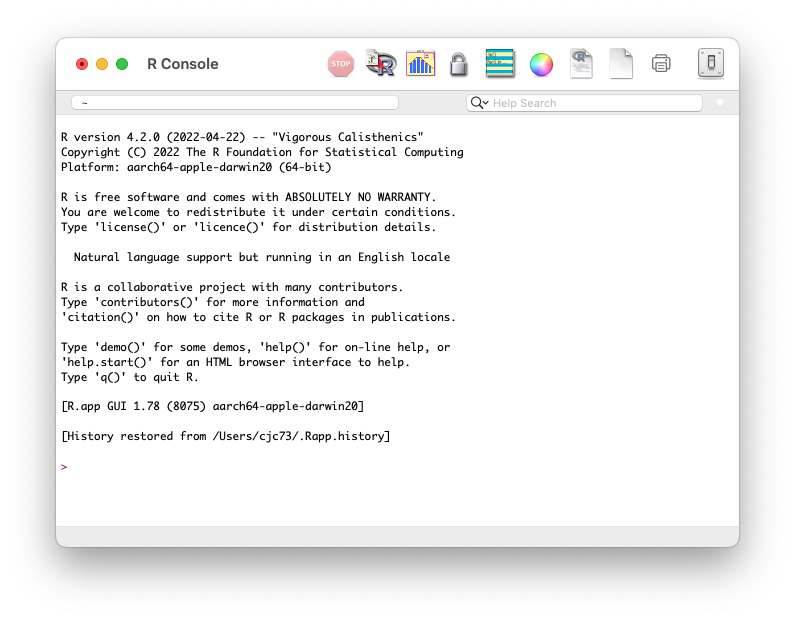

```{r setup, include=FALSE}
knitr::opts_chunk$set(echo = FALSE)
```

## XSEDE Acknowledgement 

## Terminology Slide


## Workshop Questions

1. What is R? 
2. When is R helpful?
3. What features make R worth learning?
4. Where can I get more information?


## Polls
1. How many people have used R before? 
2. How may people have used Python before?
3. Have you used scripts to run or document statistical analyses?
4. What program(s) or environments(s) do you use for statistical analysis?


## Agenda - Part 1

<div class='left' style='float:left;width:48%'>
#### Orientation to the R ecosystem
1. Motivation for R
2. Brief history of R
3. What is R?
</div>

<div class='right' style='float:right;width:48%'>
#### Introduction to R software
5. R Console
5. RStudio
3. "10 minutes to R" <br /> (*à la* pandas docs)
<!--   - Common data types -->
6. Libraries
7. Documentation and help
7. Tidyverse
</div>


## Agenda - Part 2

#### Data Analysis Examples 


## Use R for... 

- tabular data (or vectors or lists)

- statistical analysis 

- data visualization

## Less suitable for...
- unstructured data

- OS/filesystem scripting

- data scraping, cleaning and formatting


### But...

Some people want R to do everything, so packages do exist to make some of these possible!

(Someone also wrote a web-crawler in SAS)

## Major Statistical Analysis Software 
```{r echo=FALSE, fig.align='center', message=FALSE, warning=FALSE, out.width="85%"}
require(ggplot2)
require(ggtext)
require(dplyr)
require(grid)

df = read.csv("stats_envs.csv")
# make software a factor and preserve the order
df$software = factor(df$software, levels=df$software, ordered=TRUE)
df$color = 'grey'

df$color[which(df$software=='R')] = 'cornflowerblue'

df$color[which(df$software=='Julia')] ='violetred'

df$color[which(df$software=='Python')] = 'orange'
df$color[which(df$software=='SciPy (Python)')] = 'orange'
df$color[which(df$software=='statsmodels (Python)')] = 'orange'

df$face_color = "grey25"
df$face_color[which(df$software=='R')] = 'cornflowerblue'

(
  ggplot(df, aes(x=year, y=software))
  + geom_segment(aes(xend=current, yend=software), size=1, color=df$color)
  + theme_bw()
  + theme(
    axis.text.y=element_markdown(color=df$face_color, size=16),
    axis.text.x=element_markdown(size=16)
  )
  + ylab("")
  + xlab("Year")
  + geom_curve(
    aes(x=1990, xend=1995, y='Scheme', yend='R'),
    size = .75,
    arrow = arrow(length=unit(.2, "cm"), type="closed"),
    curvature = .3,
    color = "cornflowerblue"
  )
  + geom_curve(
    aes(x=1988, xend=1993, y='S', yend='R'),
    size = .75,
    arrow = arrow(length=unit(.2, "cm"), type="closed"),
    curvature = -.3,
    color = "cornflowerblue"
  )
  + geom_curve(
    aes(x=1970, xend=1976, y='APL', yend='S'),
    size = .75,
    arrow = arrow(length=unit(.2, "cm"), type="closed"),
    curvature = -.3,
    color = "cornflowerblue"
  )
  + geom_curve(
    aes(x=1986, xend=1991, y='APL', yend='Python'),
    size = .75,
    arrow = arrow(length=unit(.2, "cm"), type="closed"),
    curvature = .3,
    color = "orange"
  )
  + geom_curve(
    aes(x=2007, xend=2012, y='Python', yend='statsmodels (Python)'),
    size = .75,
    arrow = arrow(length=unit(.2, "cm"), type="closed"),
    curvature = .3,
    color = "orange"
  )
  + geom_curve(
    aes(x=1996, xend=2001, y='Python', yend='SciPy (Python)'),
    size = .75,
    arrow = arrow(length=unit(.2, "cm"), type="closed"),
    curvature = .4,
    color = "orange"
  )
  + geom_curve(
    aes(x=2009, xend=2012, y='Python', yend='Julia'),
    size = .75,
    arrow = arrow(length=unit(.2, "cm"), type="closed"),
    curvature = -.2,
    color = "violetred"
  )
  + geom_curve(
    aes(x=2009, xend=2010, y='R', yend='Julia'),
    size = .75,
    arrow = arrow(length=unit(.2, "cm"), type="closed"),
    curvature = .6,
    color = "violetred"
  )  + geom_curve(
    aes(x=1995, xend=2008, y='MATLAB', yend='Julia'),
    size = .75,
    arrow = arrow(length=unit(.2, "cm"), type="closed"),
    curvature = -.2,
    color = "violetred"
  )
  + geom_segment(aes(xend=current, yend=software), size=5, color=df$color)
  + ggtitle("Timeline of statistical software and influences")
)
```
R is a relative newcomer (as is Python) but builds on a long legacy (APL, S, Scheme).


## R, Python, and Julia

- trio of modern open-source computer languages favored by data scientists.
   - Jupyter Lab stands for the **Ju**lia, **Pyt**hon, and **R** languages

- R and Python have significant overlap and similarity, but
   - Python is more general.
   - Python tends to be favored for deep learning.
   - R and Python are both popular in machine learning.
   - R tends to be favored for statistical analysis.
   - Both have huge communities and many add-on packages.
   
- Julia is general purpose language designed at MIT with numerical computing in mind. 
   - Only recently reached version 1.0
   - Designed to be more performant but it is still developing
   - Small ecosystem compared to R and Python
   - Keep an eye on it! 


## Motivation for R

- Two faculty members at the University of Auckland wanted a "better software environment [for] their teaching laboratory" (1990s)
   - **did not like** the commercial offerings available
   - **did like** the S statistical programming language 
   - **wished** S had some of the modern language features introduced in the Lisp variant called Scheme

- R started as an S implementation with some Scheme features and was distributed via an email list.
   
- Colleague a ETH Zurich persuaded them to open source R (1995)  


#### What if we combine things we like into a statistical computing environment and make it free and open source so others could do the same?


<br />
<br />
<br />
Ihaka, Ross. (1998) R : Past and Future History, *A Draft of a Paper for Interface ’98*.  https://cran.r-project.org/doc/html/interface98-paper/paper.html 

## Collective, eclectic development

- R's developers borrow code conventions and programming styles freely. 
   - "object oriented" `object.member` naming is common but has no special meaning in R
   - Many conventions mixed together: InitalCaps, camelCase, snake_case, vars.with.dots (again, R does not assign special meaning)
   - Packages tend to work well with expected input and unpredictably with incorrect input. 
   - Many ways to accomplish any given task, inspired by different paradigms.
   
- Focus on practical, productive use
   - automatic and silent type conversion (casting)
   - convenience features can become gotchas (global namespace, attach)
      - variables names can mask functions
      - packages can mask each other's functions 

## Community

- R is used and supported by a community of largely academic researchers and developers (and more recently, data scientists).


- R gains new features via _packages_ developed by the community
   - Over 10,000 add-on libraries!
   - R packages can target highly specialized research areas.
   - R packages are used to implement and share cutting edge statistical methodology.
   - The official package collection is at [https://cran.r-project.org](https://cran.r-project.org)
   - Other collections exist: [http://www.bioconductor.org](http://www.bioconductor.org).
   - Can load packages directly from github. 

- Active community generating tutorials and demos:   
   - https://www.r-bloggers.com
   - https://education.rstudio.com/learn/

## Documentation

#### R has built-in help and documentation

#### A typical help entry includes

- *Descriptions* of each function and their arguments.
- *Examples* showing how the functions might be used.
- *References* to relevant manuals and academic papers.

#### Documentation for packages usually also includes:

 - One or  more *vignettes* demonstrating how the package can be used to perform an analysis.
 - Bundled *data sets* that support the vignette and demonstrate required data formats.

## Base R

- The  *R Project for Statistical Computing* is maintained by The R Foundation.

- It is free and runs on Linux, Windows and MacOS.  
https://www.r-project.org.

- Command line interface via R console

- Creates objects in memory rather than printing to screen. 
- You query and manipulate these in-memory objects
- Interactive, but not in the point-and-click GUI sense. 

- Script execution via `R CMD BATCH script_file.R` 

- Many people that "use R" do not use it directly. Instead they use something that interfaces with the R environment. 
  - RStudio IDE
  - Jupyter Lab notebooks
  - Google CoLab
  
  

## R Console
```{r, fig.align='center', out.width="95%", echo=FALSE}
knitr::include_graphics(path="images/r_console.png")
```

<!--  -->

## RStudio
- RStudio is an integrated development environment for R.
   - developed by RStudio Public Benefit Corporation
   - depends on installed R version
   - adds useful development, analysis and authoring features
   
- RStudio interface incorporates the R Console.

- Tip: If you want to install RStudio locally, install R and _then_  install RStudio 

- RStudio Cloud [https://rstudio.cloud](https://rstudio.cloud) is a hosted version
of RStudo with the same interface.

   - **We will use RStudio Cloud today, so no installation is needed.**


## RStudio Interface
```{r, fig.align='center', out.width="95%", echo=FALSE}
knitr::include_graphics(path="images/rstudio.png")
```

## 10 Minutes to R

1. Open rstudio workspace link: [https://rstudio.cloud/project/4044219](https://rstudio.cloud/project/4044219)

2. Login (signup if you haven't yet) already

3. Locate the tab labled `Console` in left pane (unless you have changed the layout)

4. the `>` symbol near the bottom of the console window is the *prompt*. 
   - Click to the right of the prompt and type `2 + 2`, then press `return`

```{r echo=TRUE, fig.align='center', out.width="95%"}
2 + 2
```


## End


## Slide with R Output

```{r cars, echo = TRUE}
summary(cars)
```

## Slide with Plot

```{r pressure}
plot(pressure)
```

